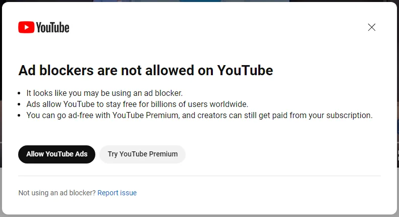

# PseudoBlocker

# Update:

Occassionally Youtube (Google) may flag users with an "Ad blockers are not allowed" pop-up for using Pseudoblocker.
It seems Youtube sends this warning out with little or no [evidence](https://www.reddit.com/r/youtube/comments/179t1p0/false_ad_blocker_report/), as a threat to deter ad blockers.
In the meantime, clicking "report issue and stating that you are not using an ad-blocker seems to work as a bandaid solution.
Thanks.

# Description:

PseudoBlocker watches Youtube ads at 16x speeds, greatly reducing the amount of time spent watching ads.

# Features:

- Speeds up playback speed to 16x
- Auto skips ads when able
- No permissions needed

# Demo:

# Installation

Setting up PseudoBlocker can be done via the chrome web store or cloned from github

### Chrome Web Store:

PseudoBlocker can be downloaded from the chrome web store [Here](https://chromewebstore.google.com/detail/pseudoblocker/dhknglbhklndbfiibpocgckdhfdagcgb)

### Cloned from git

1. Clone this repository
2. In Chrome, Navigate to `chrome://extensions`
3. Turn on `Developer Mode`
4. Click `load unpacked`
5. selected the cloned repository
6. Make sure to turn it on!

# License

This project is open source, feel free to use this code in your own project!

# Support and Feedback

If you encounter any issues or have suggestions for improving PseudoBlocker, please feel free to open an issue on GitHub. Your feedback is valuable and helps to enhance the project for all users.
